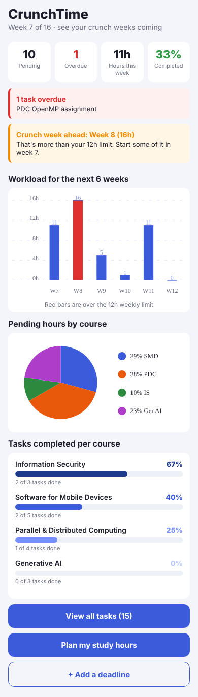
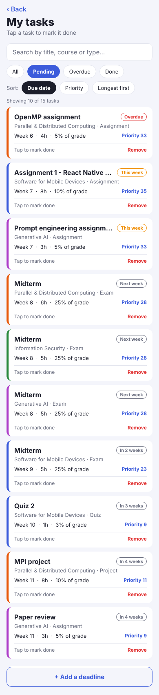
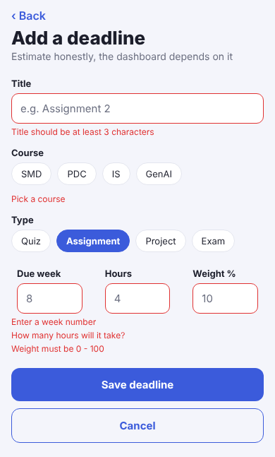
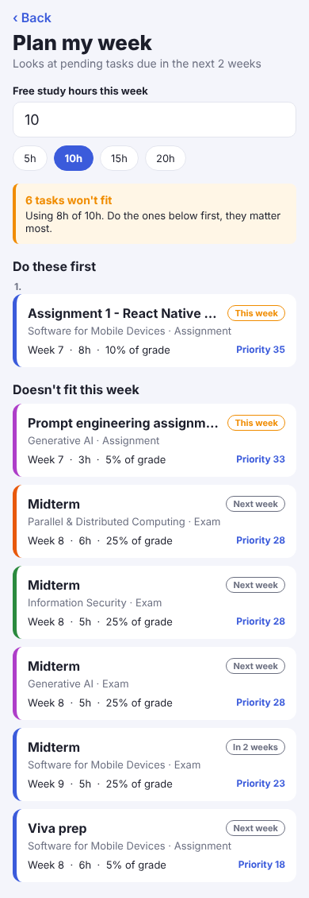

# CrunchTime

A React Native (Expo) app that shows students their **crunch weeks** before they arrive.

## The problem

FLEX shows each course on its own. You only find out that two midterms, an assignment and a proposal all land in the same week when that week starts. By then it's too late to spread the work out.

CrunchTime puts all your deadlines from every course in one place. It adds up the hours each week needs, warns you about overloaded weeks in advance, and helps you decide what to do first when you don't have time for everything.

## Features

- **Dashboard** built with `react-native-chart-kit`:
  - Bar chart of pending hours for the next 6 weeks. Weeks over the limit are shown in red.
  - Pie chart of pending hours by course.
  - Completion bar for each course with its percentage, sorted from most to least complete and shaded dark to light.
  - Summary boxes: pending, overdue, hours this week, and % completed.
- **Dynamic warnings**: a banner for overdue tasks, a banner for each crunch week ahead, and a "balanced" message when everything is fine.
- **Task list**:
  - Search by title, course or type.
  - Filter by All, Pending, Overdue or Done.
  - Sort by due date, priority or longest first.
  - Tap a task to mark it done or not done, and remove tasks.
- **Priority score** for each task, based on its grade weight and how close the deadline is.
- **Add deadline form** with validation:
  - Title must be at least 3 characters.
  - A course must be selected.
  - The week must be between the current week and 16.
  - Hours must be 1–40 and weight 0–100.
  - Number fields only accept digits.
- **Week planner**: enter your free hours for the week. It picks the highest-priority tasks due in the next 2 weeks that fit, and lists the ones that don't.
- **Empty and error states**: no matching search results, nothing pending, invalid hours, and nothing due soon.

Screens are switched with a `screen` state variable in `App.js`. There is no navigation library and no tab or side bar.

## Project structure

```
App.js              holds the tasks + current screen state, switches screens
constants.js        current week, crunch-week limit, colours, etc.
data.js             courses and tasks arrays (static data)
helpers.js          calculations: status, priority, weekly hours, filter, sort, planner
components/         Header, Chip, StatBox, Banner, EmptyState, TaskCard, AppButton, CourseProgress
screens/            DashboardScreen, TasksScreen, AddTaskScreen, PlannerScreen
```

## How to run

```bash
npm install
npx expo start
```

Then scan the QR code with the Expo Go app on your phone, or press `a` to open the Android emulator or `w` to open it in a browser.

## Things you can change in `constants.js`

| Setting | What it does |
|---|---|
| `CURRENT_WEEK` | Which semester week it is now. Changes overdue/this week/upcoming. |
| `HEAVY_WEEK_HOURS` | Hours above which a week counts as a crunch week (red bar + warning). |
| `WEEKS_TO_SHOW` | How many weeks the bar chart shows. |
| `PLAN_RANGE` | How many weeks ahead the planner looks. |

## Screenshots

| Dashboard | Tasks | Validation | Planner |
|---|---|---|---|
|  |  |  |  |

## AI usage

AI (Claude) was used during development. See the AI Usage Report for details.
